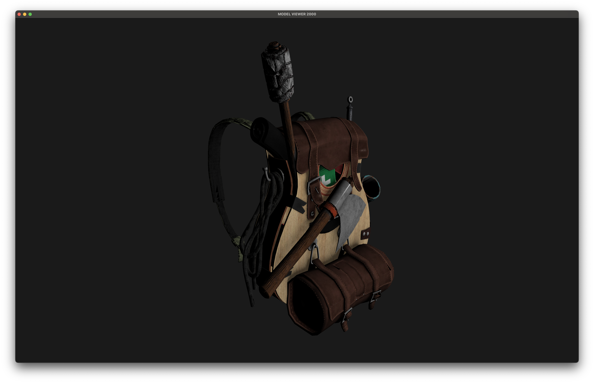

## Example image



Model taken from [learnopengl.com](https://learnopengl.com/Model-Loading/Model).

## Build
Dependencies:
OpenGL 4.1, glfw, cglm, glad, fast_obj, stb_image.

(Tested only on mac silicon)

For macOS:
```
brew install glfw
brew install cglm
make build/main
```

Usage example:

```
cd build
./main ../assets/backpack/backpack.obj
```
